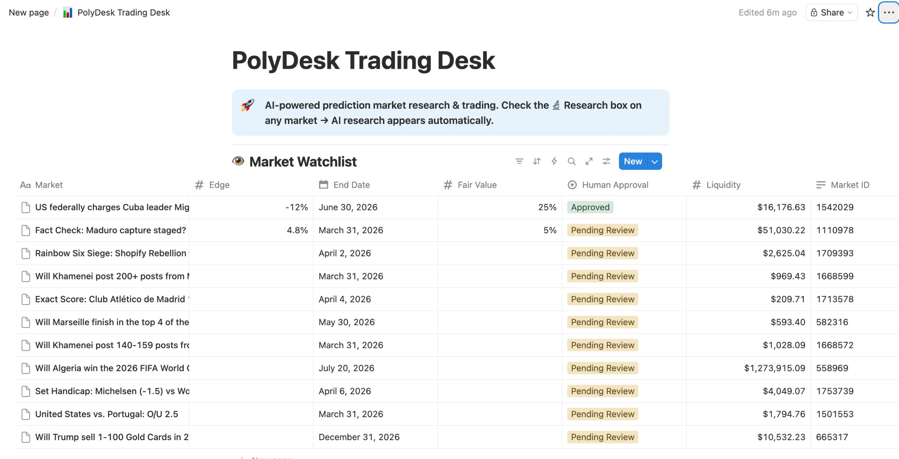
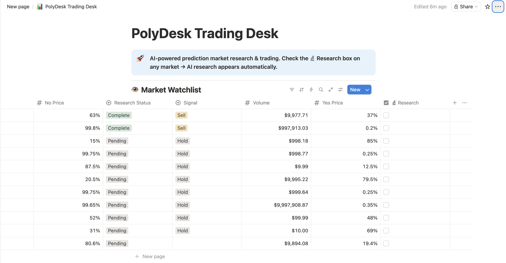
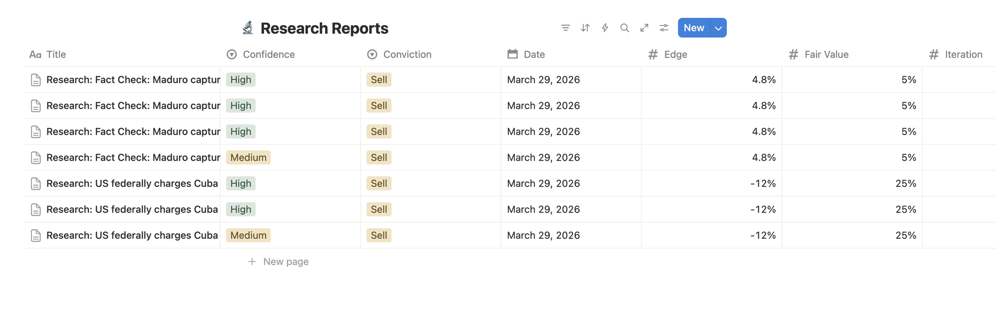
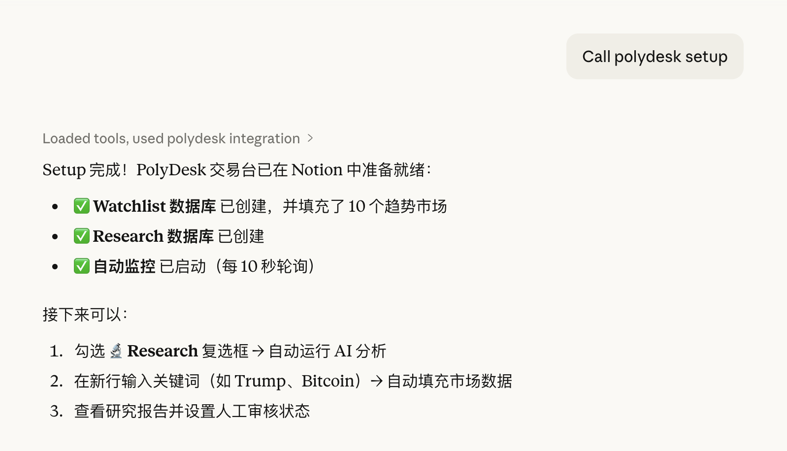
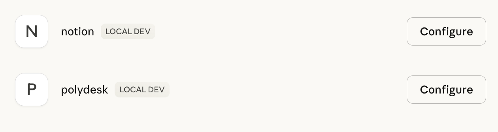

# PolyDesk — Polymarket AI Research & Trading Control Plane

An MCP server that turns Polymarket prediction markets into a structured research and trading workflow — powered by **Notion** as the dashboard and knowledge base. Zero-interaction automation: check a box in Notion, AI research appears automatically.

Inspired by [Karpathy's autoresearch](https://github.com/karpathy/autoresearch): the AI agent runs iterative research loops on prediction markets, scores them, and writes structured findings to Notion for human review and trade execution.

## Screenshots

### Market Watchlist (left columns)


### Market Watchlist (right columns) — Research checkbox triggers AI analysis


### Research Reports Database


### One-Command Setup via Claude Desktop


### MCP Server Integration


## Architecture

```
┌──────────────┐     ┌──────────────────┐     ┌──────────────┐
│  Polymarket  │────→│   PolyDesk MCP   │────→│   AI Agent   │
│  Gamma API   │     │  (this server)   │     │ (Claude, etc)│
└──────────────┘     └──────────────────┘     └──────┬───────┘
                                                     │
                                                     ▼
                                              ┌──────────────┐
                                              │  Notion MCP  │
                                              │  (official)  │
                                              └──────┬───────┘
                                                     │
                                                     ▼
                                              ┌──────────────┐
                                              │   Notion     │
                                              │  Workspace   │
                                              │  (Dashboard) │
                                              └──────────────┘
```

**PolyDesk MCP** provides Polymarket data, AI research (via local Ollama), and direct Notion integration.
**Notion MCP** (official) provides additional Notion read/write capabilities.
Together they create a zero-interaction trading control plane — all from Notion.

## Key Features

- **One-command setup** — `call polydesk setup` creates the full Notion workspace with databases and trending markets
- **Zero-interaction research** — Check the 🔬 Research box in Notion, AI analysis appears automatically (10s polling)
- **Keyword search** — Type a keyword (e.g. "Trump") in a new row, the system finds the matching Polymarket market
- **Local AI** — Research powered by Ollama (qwen2.5:14b) running locally, no cloud API needed
- **Human-in-the-loop** — AI generates signals, humans approve trades via Notion

### Tools (22 total)

| Tool | Description |
|------|-------------|
| `setup` | Create Notion workspace with databases and trending markets |
| `scan_trending_markets` | Discover hottest markets by volume |
| `search_markets` | Search markets by keyword |
| `get_market` | Full details for a specific market |
| `get_events` | Browse top events (grouped markets) |
| `get_event` | Details for a specific event |
| `get_prices` | Bulk price feed for multiple markets |
| `auto_research_market` | Structured research prompt (autoresearch pattern) |
| `research_with_ollama` | Run local AI research on a market |
| `batch_research` | Research multiple markets in one loop |
| `calculate_trade` | Position sizing, R:R, Kelly criterion |
| `check_positions` | Live P&L for open positions |
| `compare_markets` | Side-by-side odds comparison |
| `edge_scanner` | Heuristic mispricing detector |
| `format_research_for_notion` | Generate rich Notion blocks from research |
| `format_watchlist_entry` | Format market data for Notion watchlist |
| `sync_notion_watchlist` | Sync watchlist with Polymarket prices |
| `watch` | Start background polling for Notion changes |
| `unwatch` | Stop background polling |
| `validate_human_overrides` | Check for human trade approvals |
| `generate_execution_plan` | Create trade execution plan |

### Resources

| Resource | Description |
|----------|-------------|
| `polydesk://schemas/notion-databases` | Notion database schemas for Watchlist and Research |

### Prompts

| Prompt | Description |
|--------|-------------|
| `setup-trading-desk` | Bootstrap the full Notion workspace |
| `daily-research-loop` | Run a complete research cycle on trending markets |
| `trade-review` | Sync positions and generate P&L summary |

## How It Works

1. **Setup** — `call polydesk setup` creates a Notion page with Watchlist and Research Reports databases, populated with live trending markets
2. **Auto-watch** — Background polling starts automatically, checking Notion every 10 seconds
3. **Research trigger** — Check the 🔬 Research box on any market row → status changes to "Researching" → Ollama runs analysis → research report appears in the Research Reports database
4. **Keyword search** — Add a new row with just a keyword → system searches Polymarket and fills in market data
5. **Human review** — Review AI signals and set Human Approval to "Approved" → system generates execution plan
6. **Iterate** — Re-check the research box to run deeper analysis iterations (ratchet mechanism)

## Setup

### Prerequisites

- [Ollama](https://ollama.ai) with `qwen2.5:14b` model (`ollama pull qwen2.5:14b`)
- A [Notion integration token](https://www.notion.so/my-integrations)

### 1. Install

```bash
npm install
npm run build
```

### 2. Configure Claude Desktop

Add both MCP servers to your `claude_desktop_config.json`:

```json
{
  "mcpServers": {
    "polydesk": {
      "command": "node",
      "args": ["/path/to/polydesk-mcp/dist/index.js"],
      "env": {
        "NOTION_TOKEN": "ntn_YOUR_TOKEN"
      }
    },
    "notion": {
      "command": "npx",
      "args": ["-y", "@notionhq/notion-mcp-server"],
      "env": {
        "OPENAPI_MCP_HEADERS": "{\"Authorization\": \"Bearer ntn_YOUR_TOKEN\", \"Notion-Version\": \"2022-06-28\"}"
      }
    }
  }
}
```

### 3. Bootstrap Your Workspace

In Claude Desktop, say: **"Call polydesk setup"**

This creates the full Notion workspace and starts auto-watching.

### 4. Start Researching

Just check the 🔬 Research box on any market in Notion. No commands needed — research appears automatically.

You can also use Claude Desktop directly:
```
"Scan trending markets and research the top 5"
"Find markets about bitcoin and analyze the best opportunity"
"Run the daily research loop"
```

## No Polymarket API Key Required

PolyDesk uses the **public Polymarket Gamma API** — no authentication needed for market data.

## Development

```bash
npm run dev    # Run with tsx (hot reload)
npm run check  # Type-check
npm run build  # Compile to dist/
```

## License

MIT
